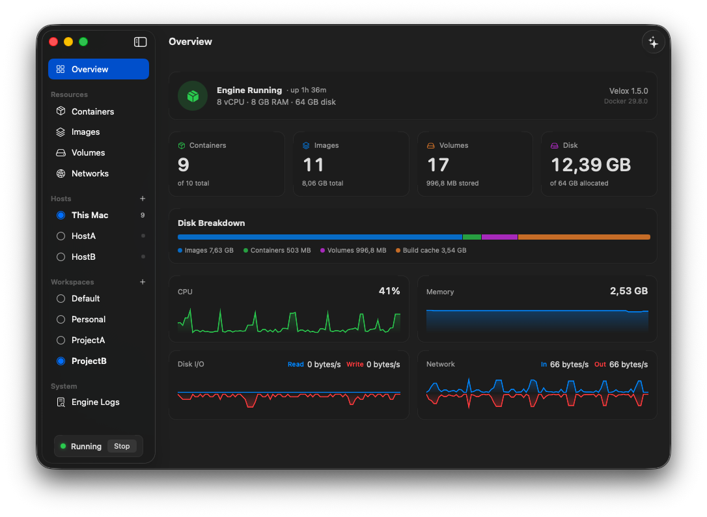
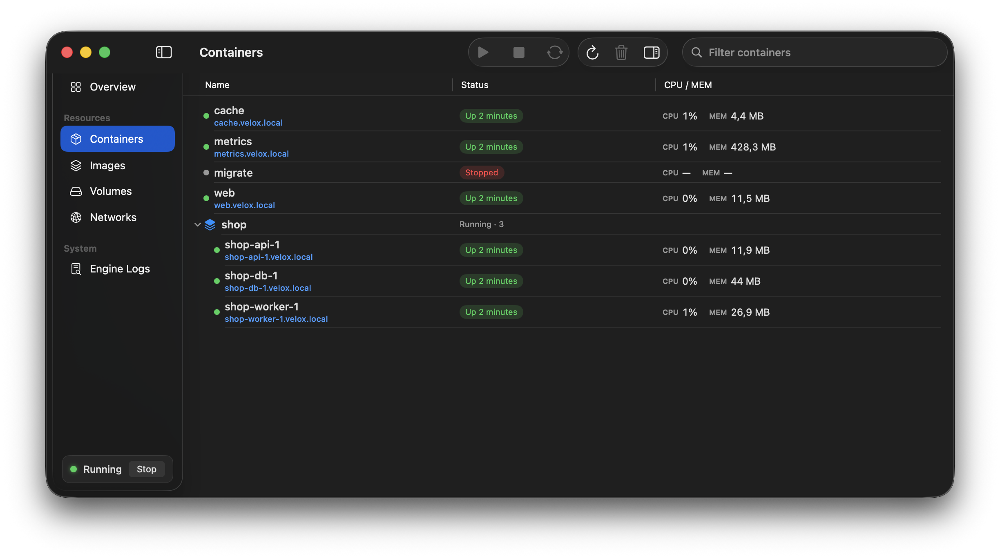

<div align="center">

# Velox

**A fast, lean, open-source way to run Docker on Apple-silicon Macs.**

100% Swift host · stock Docker Engine · custom kernel.org kernel · no Electron, no Go, no background daemons

[](https://github.com/mikaelhug/Velox/releases)


[Website](https://mikaelhug.github.io/Velox/) ·
[Benchmarks](docs/benchmarks.md) ·
[Releases](https://github.com/mikaelhug/Velox/releases)



</div>

Velox runs a real Docker Engine in a minimal Linux VM on Apple's
`Virtualization.framework` — and gets out of the way: a self-contained 226 MB
app that restarts to a ready Docker API in under two seconds and shrinks to
tens of megabytes when idle. Numbers below, methodology and a runnable harness
in [docs/benchmarks.md](docs/benchmarks.md).

## Highlights

- **The stock `docker` CLI.** No wrapper command — Velox registers a Docker
  context named `velox`, so `compose`, `buildx`, Testcontainers and every
  Docker SDK just work, alongside any other Docker install.
- **Reach containers by name** at `<name>.velox.local` — details below.
- **A native Mac app.** Compose-grouped containers, images, volumes and
  networks with live CPU/MEM, streaming logs, a ⌘K command palette, a menu-bar
  quick panel, crash notifications, and one-click Reclaim Space.
- **Nested virtualization** (M3+, opt-in): `/dev/kvm` inside containers — run
  QEMU, Firecracker or Android emulators *inside* Docker.
- **Rosetta x86** (`--platform linux/amd64`), **VirtioFS** bind mounts, the
  **containerd image store** (multi-platform images, attestations, Wasm).
- **Event-driven, never polling.** Published ports come up the instant a
  container starts; a Resource Saver balloons an idle engine down to a
  **sub-100 MB** host footprint; the guest clock survives Mac sleep.
- **Self-updating** — `velox update` or the in-app Update button.

<div align="center">

</div>

## Install

Requires **macOS 15+ on Apple Silicon**. Guest kernel, rootfs, engine and the
`docker` client are all bundled.

```bash
curl -fsSL https://raw.githubusercontent.com/mikaelhug/Velox/main/install.sh | bash
```

Or manually: download the `.zip` from [Releases](https://github.com/mikaelhug/Velox/releases),
drag **Velox** to Applications, and clear Gatekeeper's download quarantine
(Velox is signed but not notarized):

```bash
xattr -dr com.apple.quarantine /Applications/Velox.app && open /Applications/Velox.app
```

First launch boots the engine, puts `docker` + `velox` on your `PATH`
(rootless symlinks), and registers the context:

```bash
docker context use velox
docker run --rm hello-world
```

The app keeps the engine running while open; `velox start` runs it headless.

## Reach containers by name

Every container is reachable from the Mac at **`<name>.velox.local`** — its
*real* IP, any protocol, no `-p` required. Pure DNS + routing, no proxy in the
data path:

```bash
docker run -d --name web nginx
curl http://web.velox.local          # no published port needed

docker run -d --name db -e POSTGRES_HOST_AUTH_METHOD=trust postgres
psql -h db.velox.local -U postgres   # any protocol, not just HTTP
```

Compose services resolve as `<service>.<project>.velox.local`. This needs a
one-time admin grant on first launch (a tiny root helper installs a route and
an `/etc/resolver` entry — control-plane only, it never touches connection
data); decline it and everything else still works.

## Performance

Measured against Docker Desktop on the same Mac, the same way: both engines on
`Virtualization.framework`, identically configured (8 vCPU), one engine under
load at a time. Full methodology, fairness controls and a harness to reproduce
every number are in [docs/benchmarks.md](docs/benchmarks.md).

| Metric | Velox | Docker Desktop | vs Docker Desktop |
| --- | --- | --- | --- |
| Install footprint | 226 MB | 2,328 MB | 10× smaller |
| Idle RAM (host RSS, all processes) | ~0.9 GB | ~3.3 GB | 3.7× less |
| Startup (restart → API-ready, warm) | 1.74 s | 2.55 s | 1.5× faster |
| Container launch (`run --rm alpine true`) | 104 ms | 160 ms | 1.5× faster |
| Network — container → host (iperf3) | 88.8 Gbit/s | 27.0 Gbit/s | 3.3× faster |
| Published port — host → container (4 streams) | 59.2 Gbit/s | 18.0 Gbit/s | 3.3× faster |
| VirtioFS bind-mount write (`dd` 1 GiB) | 2,951 MB/s | 956 MB/s | 3.1× faster |
| Small-file extract (4,000 files → bind) | 0.21 s | 3.43 s | 16× faster |
| Durable commit latency (`fio --fsync`, 4 K) | 0.31 ms | 0.47 ms | 1.5× faster |
| Container-overlay write | 1,695 MB/s | 1,217 MB/s | 1.4× faster |
| Postgres `pgbench` TPS (8 clients, 30 s) | 13,318 | 11,690 | 1.14× faster |
| Cold image pull (381 MB on disk) | 19.1 s | 17.3 s | ~10% slower |

The idle-RAM row is the loaded benchmark baseline; an empty idle engine
balloons further down, to a ~70 MB host footprint. Cold pull is the one path
that trails (~10%), because durable layer extraction is fsync-heavy — the
visible cost of the durability described below.

The data disk is durable by default: a raw image attached with
`synchronizationMode: .fsync` and guest barriers on, so every committed write
survives a crash, a power-off and in-place updates, at about 0.3 ms per
commit. Periodic `fstrim` returns freed space to macOS automatically.

## How it's built

- **One Swift process** hosts everything: VM lifecycle, the Docker-API VSOCK
  proxy, port forwarding, DNS and the SwiftUI app. The only privileged piece
  is a tiny optional root helper for `<1024` ports and the named-access route.
- **Apple's in-kernel networking (VZNAT)** is the container datapath — no
  userspace network stack anywhere.
- **The kernel is built from kernel.org source**: `tinyconfig` plus a curated
  fragment, monolithic, tuned for fast container launch (`HZ_1000`, expedited
  RCU).
- **A tiny Rust `vinit` is PID 1**: one static musl binary does every boot
  step via direct syscalls — mounts, cgroups, clock, native DHCP, data disk,
  Rosetta — then supervises stock `dockerd` on a read-only, demand-paged
  **erofs** root. No LinuxKit, no initramfs, no dind.
- **Native-first**: prefer what dockerd and the kernel already provide (e.g.
  dockerd 29's nftables backend — the legacy iptables packages are simply not
  shipped); anything genuinely custom is focused Rust.

Every version is pinned in one file (`versions.env`); CI builds a release on
every `v*` tag.

## VPNs

Velox coexists with VPNs — including full-tunnel WireGuard — with one known
interaction: some VPN clients (notably the OpenVPN-based **AWS VPN Client**)
silently switch off macOS's kernel packet forwarding when they connect, which
kills NAT egress for **every** VM on the Mac (vmnet-based Docker engines, UTM,
Internet Sharing…), not just Velox. The symptom is DNS resolving but every
container connection timing out. Velox detects the flip the moment it happens
(event-driven, no polling) and restores forwarding through its privileged
helper, so container networking keeps working with the VPN connected. If the
helper grant was declined, the engine log names the cause and the one-line
manual fix (`sudo sysctl -w net.inet.ip.forwarding=1`).

## vs Apple's `container`

Apple's [`container`](https://github.com/apple/container) validates the same
architecture (kernel.org kernel, tiny init, Swift on Virtualization.framework)
but speaks no Docker API — compose and Docker tooling don't work — and its
VM-per-container model can't share named volumes and pays a VM boot per
container. Velox is a *Docker engine*: one shared VM, the real API, and it
runs on macOS 15, not just 26.

## Build from source

Needs Docker (guest builds run in `linux/arm64` containers) and a Swift 6
toolchain (Command Line Tools are enough).

```bash
./Scripts/build-kernel.sh   # one-time: compile the kernel from source (long)
./Scripts/make-guest.sh     # build the erofs rootfs; install to ~/.velox
./Scripts/build.sh          # swift build -c release + ad-hoc codesign
./Scripts/build-app.sh      # package a self-contained Velox.app
./Scripts/run.sh start      # or: boot headless with a serial console
```

The signing entitlement is `com.apple.security.virtualization` only. Kernel
config lives in `guest/kernel/velox.fragment`; the guest filesystem in
`guest/rootfs/Dockerfile`.
